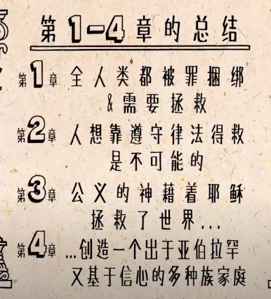

# 罗马书(Romans)

### 08302021（2-6）

### 08312021（7-10）

### 09012021（11-16）

## Overview

.png>)

保罗==phd/法利赛人/正统犹太人（便雅悯支派）

写罗马书的时候年近60，在第三次差传布道旅途中写的，同时期还写了哥1，2

在访问罗马之前写的，提前介绍自己

整本书中”律法“出现了70多次

整本书的内容：主要是讲**犹太人和外邦人的关系**

先将信念，再讲行为： 先将跟神的关系，再聊你们之间的关系

## Bible Project

### 1-4

 宣教生涯后期所写

 希望罗马教会合而为一（因为犹太人曾经被驱逐，犹太人VS非犹太人，对很多传统细节有争议）

 外邦人和犹太人-->都有罪

 耶稣不是来审判，而是来救赎（自己钉死在十字架代替成为多人的救赎）

 称义：耶稣实现了神对亚伯拉罕的应许





接下来会围绕因信称义来聊


### 5-8：创造全新的人类

 亚当=旧生命  VS  耶稣=新生命

 洗礼：让耶稣进入我们生命

 \#7：关于律法（以色列人违背了所有的诫命）

.png>)

 罪，的解决方法：**耶稣 & 圣灵**

### 9-11：实现神对以色列的应许（保罗的写作目的）

 **11章**也是罗马书的论点，开头提问 

以色列人并不会因为血统而承受应许

 承受应许的人是选择耶稣的人

  神与以色列人立约不是通过律法，而是通过耶稣

  将来神，不会，放弃以色列人

 

### 12-16：使教会合一

  彼此相爱，宽恕

 爱神，爱人如己-->实现旧约律法的最大诫命

 

.png>)


## C1

首先搞清楚保罗写罗马书的**`目的`**（不是1-8，不是12-16）

罗马教会主要由**外邦人**组成

 上帝的旨意：先救犹太人，再救外邦人（并没有偏倚，但是这是神的顺序）

 希利尼人= 希腊人

 16-17： 勾画了全书主旨：**因信称义**

义：是神的本性，人是靠着对基督的信心得到义，不是出于自己的善行

**背景：**罗马教会的历史：四个阶段

* 清一色的犹太人的教会
* 犹太人+外邦人（罗马是世界中心）
* 犹太人和信徒被赶走，只剩下外邦人
* 尼禄（前期明君，后期暴政）上位，邀请犹太人回来，尼禄烧毁罗马重建嫁害给犹太基督徒。外邦人反感回到罗马的犹太人

写给大多数未曾谋面的人，因此要自我介绍一下（因为罗马教会不是保罗建立的，不可以一上来就直接斥责（加拉太书））

6节：保罗是耶稣的【奴隶】：奴隶，是完全属于主人

罗马教会：类似家庭教会形式的（所以保罗是写给各个罗马的教会）

 基督：坐王，新约里面弥赛亚的称呼，**福音**就是关于耶稣基督（救人脱离罪 + 坐王（带领人们进入光明））

  后面讲了外邦人犯的罪

> 最小的罪，都要判死刑，为什么？ -->只有这样，罪才可以不复存在。

罪是没有办法衡量的，只有犯罪了VS没犯罪之分，没有罪的大小。

## C2

 第一章结尾讲了外邦人犯罪。 

讲犹太人犯的罪，换了人称 （因为保罗是犹太人）-->人人都有罪，人人都亏缺神的荣耀

> 为什么一上来先讲罪？

 “福音必须先是坏消息，再是好消息”：**先讲罪，再讲救赎**，没有罪，哪里来的救赎？

> 你希望耶稣救你脱离什么罪呢？这是悔改的起点，不是所有的罪
>
>  罪，公义，审判 各是什么？

人人都犯了罪

> 12节，没有摩西律法的外邦人犯罪，会灭亡不？

.png>)

保罗指责不义之人（外邦人）做两件事：

* 压抑上帝存在的事实，真理
* 用谎言取而代之

保罗指责犹太人犯罪（使用“你们”） 

 25-29： 犹太人行割礼，需要内心受割礼， 否则没用

 保罗还谴责犹太人：自以为义

 知道律法没有用，遵守律法才行


罪：外邦人犯罪，犹太人犯罪，全人类都是罪人（都不合格）

**3:9-10: 没有义人，连一个都没有（结论）**

## C3

 犹太人的益处？特殊？平等！只是神愿意拣选犹太人而已。

3-5章开始讲称义，要先信，才能称义

 3章-5章：得救（因信称义）

**3:9-10: 没有义人，连一个都没有（结论）**

 因为世人都亏缺了神的荣耀

 因信称义，但是因为**行为**受审判

 **称义：**法庭上的用词，宣告无罪 （脱罪-->无罪）

 十字架：彰显公义

**救赎：**原用于奴隶市场，付出代价，奴隶可以得到释放。

> 耶稣救赎了我们？我们是否是耶稣的奴隶？奴仆？

**因信成全律法**

## C4

 亚伯拉罕是犹太人和外邦人的父（引用旧约来说明称义）

  亚伯拉罕献以撒：以**行动**表示信靠

 福音的核心：耶稣替人受罪的惩罚， 而我，需要**信靠  **（相信VS信任）

** 信心：**信任 + 信服（抓住看不见的东西，所望之事的实底。。。）

 "现在我知道了"。 

> 神知道不知道亚伯拉罕会献祭以撒？ --不知道->神给人的自由意志

 出来的羔羊：预表耶稣-->旧约可以看到新约的内容（头戴冠冕，羊羔被缠绕）

因信放弃律法？-->断乎不是-->后面会讲到，爱可以成全律法

不是行善的报酬，而是信心的礼物

> 亚伯拉罕没有受割礼的时候，已经称义，为啥？  -->本乎恩


撒拉生以撒：神的旨意    VS  夏甲生以实玛利：人的旨意

 后果很惨：后代时代为敌

亚伯拉罕死的时候是住着帐篷的，因为**相信神的应许**，要给他一座城

## C5

.png>)

**  信靠耶稣之后能够立刻收获很多（后面讲得救的生活）**

**相和**：have peace with God  -->平安（现在就有）、盼望、恩典、荣耀

（信，望，爱，其中盼望最容易被忽略：盼望=绝对确定，尤其是今年，没有盼望)

 患难->>盼望，患难是好事儿，能够磨炼我们

**救赎的三个部分：称义，成圣，荣耀（荣耀的盼望）**

 **现在就有的：**平安， 来到主的面前（现在就有），我们可以随时立即和万王之王沟通，来到神的面前

_7-8：为义人死，为仁人死，哪一个更容易？ （耶稣为敌人死）_

> 先有律法，还是先有罪？

_12-21：一人犯罪，带来罪，一人受死，赎罪（要接受亚当犯罪带来了罪，不然无法接受耶稣赎多人罪，公平？）_

 _在亚当里：人人都会死-->一人犯罪，毁灭全人类_

_ 在耶稣里：人人都可以永活_

## C6

6-8：成圣，得胜  

** 6-8重点：基督徒可以选择：顺着肉体 VS 顺着圣灵**

 **得救：**是一个过程，信主受洗的那一刻是**开始得救，**仅仅是之前的一笔勾销**（**为啥耶稣是**道路）**

** 得救三个过程：称义（起点），成圣（很长，目的是得着荣耀，彻底摆脱罪），得救**

** **_**（**水平过程（坐标轴）VS垂直过程（有时信心倒退）**）-->福音误区：只要信就彻底得救=垂直过程 **_

 （在水中受洗是得救的必然条件，受圣灵洗）-->necessary

两者信心冷淡的方式不同：

 外邦人：回到放纵生活 （6）

 犹太人：回到律法主义（7）

 keyword: 过程  --> 也就是将得救的生活，信主厚的生活，基督徒的生活

圣灵 VS 肉体（老我） -->得救的过程会有拉扯


#### 我是主的奴隶！！！

_奴隶=奴仆（原文：slaves）： 奴隶是被人买/赎回来，它属于自己的主人_

* 上帝的奴仆：白白得到永生
* 罪的奴仆：得到工价-->死

## C7

_律法不能使人成圣，律法只能让人**知罪**_

 Religion VS **Relation：**

** **叫人死的乃是罪，不是律法

 （法利赛人搞耶稣的原因主要是：认为耶稣违背了律法犯了罪，罪的律法是死）

_保罗：”我真是苦啊"，因为生活在世界上，属肉体的，属罪的_

**苦楚（保罗的呻吟）**（本意：我们脱离不了罪的诱惑）-->我们生活的社会以及先进的情况

苦楚的原因：人类的软弱

## C8

_6-8： 一句话总结：**向着标杆直跑**（成圣的生活，讲的就是现在） = “行” (因为神给我选择的权利：肉体VS圣灵)_

 _保罗：**绝对不能，**回到罪，回到旧/肉体的生活（外邦人放纵，犹太人亲律法）_

 9-17： “若、如果，if” 出现六次： 如果肉体-->? 如果圣灵-->?

 最后一个如果：没有受苦，就没有荣耀

_ 7章提到了靠肉体，8章提到了靠圣灵_

_所有的：_

1. _**万事互相效力，爱神的人有益处：**所有的，都会对你有益处（主动权在神的手里-->益处：效法他儿子的模样，是荣耀，是美德-->能够越来越像基督）_
2. _所有的人都无法控告我们，无法定罪_
3. _所有的事儿都隔绝不了神的爱 （所有的，唯独“你”） -->之后会读到为何“你”可以_

#### 没有什么可以使我们与神的爱隔绝了

## C9

.png>)

9-11: 罗马书的**核心（很重要，经常被忽略）**

** 神的拣选，神的主权，但是人的选择（神学大论，两个方面都是真的，目前无法解释，无法明白）。**

** **以色列->指犹太人，而不是指教会：提到了很多次，呼应8章结尾：没有人能够使我与神的爱隔绝，那犹太人呢？（断乎不是，因为神拣选了犹太人，应许就一定不会落空）

_新约首先是给犹太人立的约，基督也是从犹太人出来的，是上帝的选民（上帝选人是按照他的旨意，比如选小儿子（雅各，以撒，大卫），如今依然如此）===> **上帝不是拣选他们得救，而是拣选他们来侍奉他**_

 整个历史，耶稣是唯一选择被生下来的。（我们都没有选择父母）。

上帝选错了么？--> 雅各的后裔并不都是以色列，但是总会有忠于上帝的_**“余民”**_（重要的角色，完全在于上帝的拣选）

**上帝的拣选是有理由的**，不是随机的（神使法老的心刚硬，因为法老前几次都刚硬），上帝拣选犹太人的理由：**将福音传给外邦人，做世界的光。**

  _（犹太人人口百分之一，但是科学家里面犹太人占四分之一，很小的民族，很大的影响力，好莱坞五个制片厂，都是犹太人的，但是他们在传福音上亏欠了很多，我们生活中很多东西都是犹太人发明的，但是我们的福音不是犹太人传的，是外邦人）_

 保罗结尾道出事实： **犹太人进天国反倒更难**==犹太人信主更难（因为犹太人想要靠着自己）

## C10

 律法的总结就是基督（基督成全律法）

 （靠着信心称义后通过依靠圣灵可以行出律法所规定的所有行为，使律法得以成全）

.png>)

** 如何称义：口里承认，心里相信(所以不分种族，肤色，外邦人)**

继续回到犹太人：**犹太人的问题是都听过耶稣，都知道旧约，但是没有听进去** ==》回顾以赛亚书“你们听是要听见，却不明白“ _（耶稣quote, 保罗quote（在罗马给犹太人传道））_

_**结尾：**上帝成天伸手招呼以色列百姓（可是却听不进去）_

## C11

 基督教-->恩典/其他宗教-->行为 ==》救自己 

保罗希望看到罗马有：犹太人和外邦人的教会（希望犹太人和外邦人在同一个教会和平共处）

_  ”犹太人未来会得救“from保罗 （核心：**上帝没有抛弃犹太人**）_

 犹太人受到批评，基督徒排斥犹太人（基督徒认为犹太人杀死了耶稣（实际是外邦人））

 **救恩临到外邦人**：保罗**给犹太人传福音，遭到拒绝，就传给外邦人**-->一路向西传到地极（我们就是活生生的例子，我们就在见证神的应许） 

 保罗给犹太人传福音的技巧：强调外邦人找到了犹太人的救主，让犹太人羡慕/**嫉妒 -->**但是对外邦人来说很危险（傲慢，自大）

 **🌲的比喻：**根是犹太人的根，圣经是犹太人的圣经，神的拣选没有改变（防止外邦人骄傲），同时犹太人不信的话也会被砍掉，但是也会接回去的。**道理：**你们都是一样的

**==>被砍掉：回来扣题-->得救是一个过程，不是受洗后就永远得救了，（做的不好会被砍掉）==》得救不是因为起初的信心，而是因为坚持到底的信心（受洗信主是得救的起点）**

_**约翰3：16：叫一切（持续）信他的，不至灭亡，反而（持续）得永生。**_

最后讲了神的应许，我们的未来跟犹太人密不可分，彼此相连。期待我们能见证。

## C12

 爱神的人得益处：更加像基督的样式（前情提要）

.png>)

** 本章主要讲To do & Not to do (旧约摩西律法613条，新约诫命1100条) **

_** **关于**献祭**：将身体献上（基督教很”物质“），其实要求是更高的_

《我的真面目更丑陋》（神知道我们有多丑陋，但是仍然爱我们）

 变色龙 VS 毛毛虫（why毛毛虫？开始丑陋，但从里面变化，最后破茧而出）

_** 恩赐**_

.png>)

.png>)

**以爱过教会生活：**

1. 真诚
2. 火热
3. 谦卑
4. 和睦同心
5. 饶恕

## C13

**顺服：**因为良心去顺服，而不是因为惧怕去顺服（开车限速的比喻） 

基督徒和国家政府之间的关系（当时的罗马-->独裁政权（共和国->帝国（当时罗马的头15个皇帝，有14个是公开的同性恋）））

 上帝会投出决定性的一票（政府是上帝设立的）：联想到最近的大选，just a show

_ 谁真的掌权（repub VS demo）-->首先明白这一点要_

_ 需要尊敬政府，人民要履行政治责任，但是避免政府的腐败_

_  为掌权者祷告_

“我们的得救更近了”： 我们在得救的道路上，即是过去式，也是将来时

> 我们是否已经得救？我们还在得救的路上？

”基督徒有可能失去救恩“，“一次得救，永远得救？”

**以爱过教会生活：**

1. 顺服政府
2. 爱完全了律法
3. 要行在白昼

## C14

 14-15： 信心软弱的人的基督徒如何相处

** 14-16：教会中肢体之间的关系**

 犹太人基督徒和外邦人基督徒的关系（罗马教会的外邦基督徒不欢迎犹太基督徒再回来，_整个罗马书都是为了化解这种紧张的关系_）

 _保罗gives two examples: （目的：劝解信心强的基督徒要迁就/配合信心弱的（22节））_

1. _有人坚持吃素（经文：神国不在乎“吃喝” （罗马书唯一一次提“神的国”））_
2. _关于守安息日  （耶稣安息日行神迹）_

_  ==>无论做什么，要出于信心_

> “不可使弟兄跌倒“，这是对谁说的？-->信心强的基督徒

 **原因：**良知和文化背景不同（基督徒可以化妆？抽烟喝酒？男女分开坐？。。。）

  犹太人2000多年一直保守的：割礼，洁净的饮食，安息日

犹太人的顾忌：

1. 饮食，能吃什么（不洁净的）
2. 特别的日子，安息日（周六， 周日？）

> 成熟的基督徒会有更多自由，可以做更多的事儿（耶稣安息日救人）


## C15

 自己时犹太人，但是对外邦人有负担（不仅在圣经中，在生活中也有神的应许，福音一路向西传。。.）

.png>)

**同心合意一起敬拜他（这个是保罗希望看到的，因为可以反推当时的情况）**

插曲：耶稣一生中基本都在跟犹太人打交道，只有两次向外邦人显神迹，但是耶稣让自己的十二个犹太门徒将福音传遍万国

 犹太人欠外邦人：福音

 外邦人欠犹太人：耶稣（耶稣是犹太人的弥赛亚）

传福音三个面向：话语，行动，神迹（新约圣经的传福音方式 ）

** 保罗刚信主时，犹太基督徒不欢迎他（因为他曾迫害基督徒），因此自己去罗马自知凶多吉少。（保罗带人信主没有行割礼，没有行摩西律法）**

**12-15：很多”彼此“-->**

## C16

 主要是名字，呼吁外邦人向犹太人基督徒**亲嘴问安 **

.png>)

** 这是新约中最长的问候名单，大多是问候犹太人 **

.png>)

 （不要忽略）近的和远的人际关系

建造更宽广的的基督徒网络（就像现在的读经群)

17-20节：有一些人不要欢迎来，教会要小心欢迎任何人（联想到我刚来美国，进入教会），千万不要欢迎破坏者


## Conclusion

** 书信的读经方式-->全面的了解（淡化章节划分）**

** 重要性**

.png>)

.png>)


.png>)


.png>)

.png>)


**高频词汇：**

* 上帝
* 耶稣基督
* 律法
* 信心
* 义（上帝的义）

全篇看：先讲道理，再讲行为。

### 1. 序： 问候 + 点出福音是什么？

```java
福音就是关乎上帝公义的好消息，而上帝要把这个义白白赐给我们

罗马书的重点不在传福音，不是福音书，这本书的福音不是对所有人针对所有人的福音（比如悔改，就没有cover）
//主要是针对犹太人和外邦人基督徒的
```

### 2. 罪人：外邦人->罪人， 犹太人->罪人， 全人类->罪人

```java
外邦人问题：  不义 
犹太人的问题：自以为义（不应该因为有律法就可以称义（听VS行））
//在讲到因信称义之前，讲了错误的称义方式 
```

### 3. 得救：因信称义

```bash
 好人进天国更难
 #好人容易自以为义，以自己的行为称义
 
 得救是一个过程（出黑暗 + 进光明）
 #受洗那一刻起已经得救（过去式），主再来的时候我们会最终得救（将来时）
 
 Example: 亚伯拉罕
```

### 4. 得胜：在生命中坐王，胜过犯罪的天性

```bash
因信称义 -->因行为受审判
#因为行为是信心结出来的果子。因此基督徒犯罪是很严重的

保罗的呻吟：我真是苦啊
```

### 5. 拣选：犹太人和外邦人的角色

```bash
犹太人：有选民的地位，没有活出选民的生活
#BUT，神并没有放弃犹太人

神的主权
```

### 6. 教会生活

```java
在因信称义的根基上如何去活

信心强的帮信心弱的（跟社会规则相反）
```

### 7. 结语问候

```java
被问安的人都是保罗生命的见证
```



Reference : 大卫鲍森，圣经简报，圣经工程

